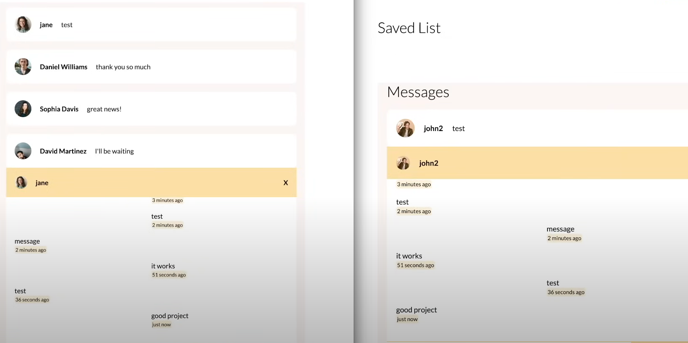
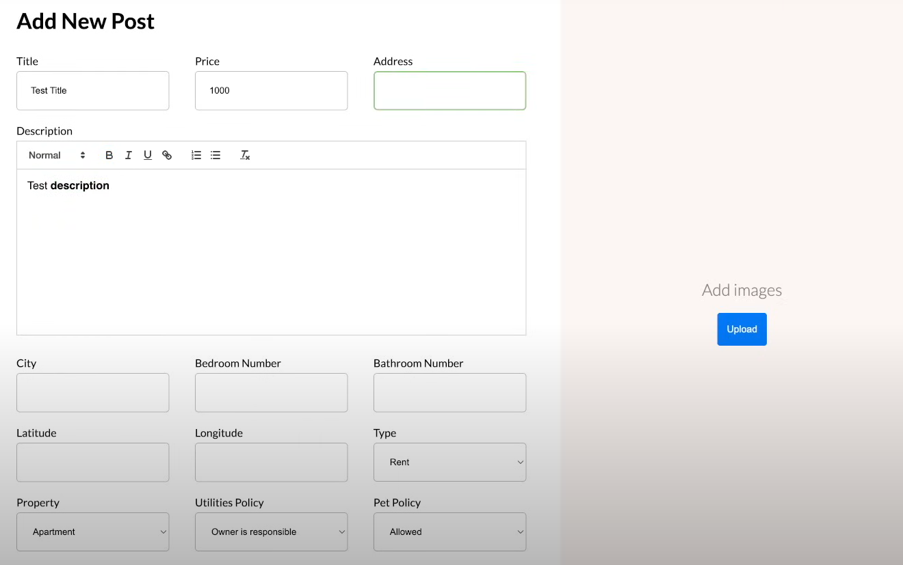
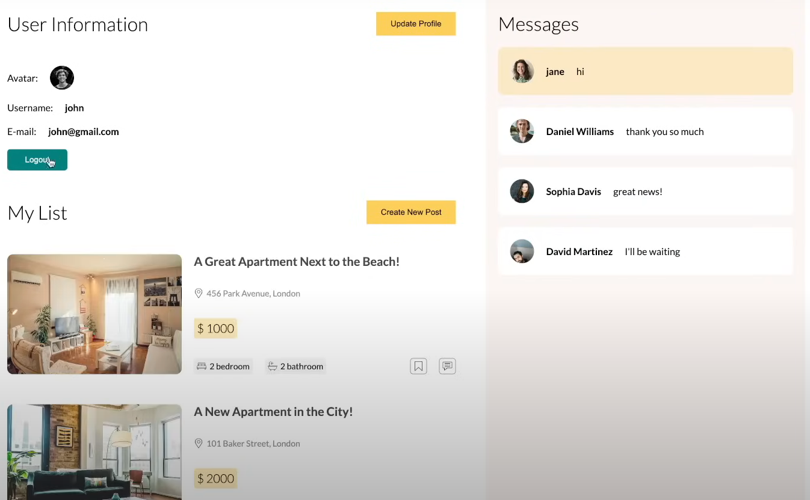

# EstateVista

EstateVista is a real estate application built using the MERN stack, enabling users to search for properties efficiently. The project leverages the power of Socket.io for real-time communication, providing a seamless user experience.

## Technologies Used

- **MongoDB**: For the database, providing a flexible, scalable, and efficient way to store data.
- **Express.js**: As the backend framework, offering robust features for web and mobile applications.
- **React.js**: For the frontend, creating dynamic and responsive user interfaces.
- **Node.js**: For the server-side runtime environment, ensuring high performance and scalability.
- **Socket.io**: For Realtime seamless messages and chating.
- **React-Quill**: For Robust Text Editor for posting about estate views.

## Features

- **Property Search**: Users can search for properties based on various criteria.
- **Real-time Updates**: Using Socket.io, the application provides real-time updates to users.
- **User Authentication**: Secure user login and registration.
- **Property Management**: Users can add, edit, and delete property listings.

## Screenshots

 
